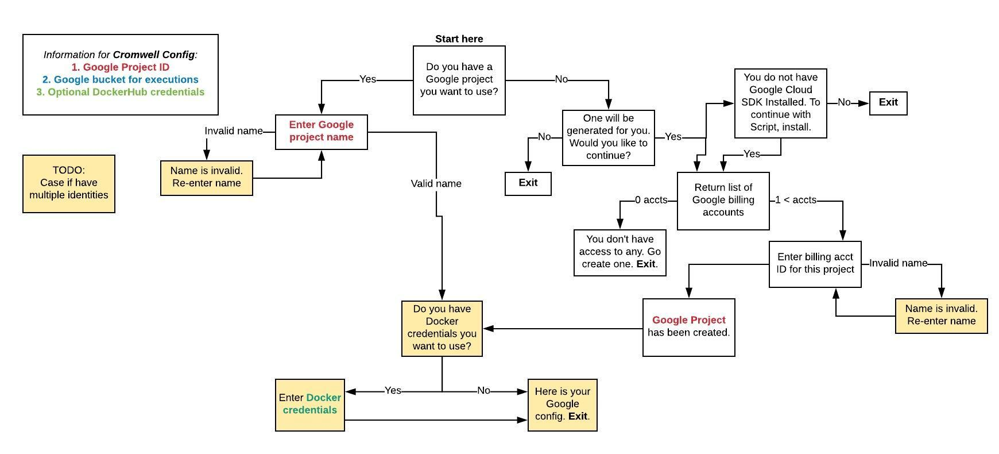

## Design Document

### My background
I work at the [Broad Institute of Harvard and MIT](https://www.broadinstitute.org/) within the [Data Sciences Platform](https://www.broadinstitute.org/data-sciences-platform). Our department creates a software platform for genomic analysis, including DNA realignment, variant discovery, and more. 

Previously I worked as the Product Manager for the team creating the Cromwell execution engine, which accepts submissions of analysis pipelines and submits them to the Google Cloud Engine, specifically the Google Genomics Pipelines API.

Recently I switched to an engineering team in order to learn to code, thus why I enrolled in CS50. As a part of my work on this team, I create scripts to help users when they reach the limitations of the software. I also help debug user issues, instruct users on how to properly use our software, and give feedback to our development team for improvements and requested features.

### Project motivation
Many computational biologists and scientists have a wide range of computer literacy. In order to run their pipelines at scale they may want to use our Cromwell engine to run them on Google Cloud. They can also use Cromwell to run their pipelines locally on their laptop, or on an HPC cluster such as Luster, UGER, SGE (now OGE), and more. We are also building support for running Cromwell on AWS. Each of these backends, as we call them, require a different configuration. This configuration contains the user's credentials and other necessary information. Read more about the [Cromwell configuration](http://cromwell.readthedocs.io/en/develop/Configuring/) and try out the [Quick Start tutorials](http://cromwell.readthedocs.io/en/develop/tutorials/ConfigurationFiles/).

### Purpose

The purpose of this Python script is to walk the user through the steps necessary to set up a configuration file for running on GCE (Google Cloud Engine). At each step the script is gathering information for the configuration file, or setting up the necessary Google elements. The ultimate goal is for the user to end the setup script with a configuration file that they have successfully tested by running a simple "Hello World" pipeline through Google Cloud.

### Prerequisites

### Steps in the script

In order to set up a configuration file, the user needs a Google billing account in order to create a Google Project. Then the user needs a Google Bucket within that Project, and to link their Billing account to the bucket so that they can use the bucket to store files. 

#### Decision map:
To aid in my conception of the coding pathways, I created a flow chart of pathways that users could take. This helped me to map out how to plan my structure before I coded it, and it helped me to consider situations that a user could end up in, to make sure they didn't hit any obvious edge cases.

Chart: [Lucid decision map](https://www.lucidchart.com/documents/edit/59dc6c72-3dcc-4b4c-8948-6dfff1e01cfd/0)

There are always edge cases with every program. The trade off is the time to cover every edge case compared with the user experience (and success) in using the program. For common use cases, it is worth the time to test and specifically code to make sure that the user is successful. For uncommon use cases, or edge cases, it may not be worth the time to make sure that absolutely all users are successful in using your program. For example, if a user is trying to download something but they lose connection to the internet, there are a number of different errors they could reach. It is reasonable for a program of this type, since it is run on the command line, to assume that the user has a certain degree of technical familiarity, which allows them to debug simple issues.

### Considerations:

#### Python 2
Due to technical considerations, I had to code in Python 2 rather than Python 3. We are using a program elsewhere that is still limited to Python 2. While coding I found that many of the conventions were the same, with some small differences. The first I noticed is that `print` does not use parentheses, so `print ("Hello, World")` in Python 3 is the same as `print "Hello, World"` in Python 2.

#### `if`/`else` or `try`/`except`:
The nature of this setup script means that there are many decision trees. I explored `try`'s and learned about how they are a good coding practice. Catching exceptions, with `try` and `except` is a good coding practice when writing a program in Python because it allows different parts of the program to decide how to handle the exception. It also prevents the user from seeing an ugly error. There are many built-in  exceptions, defined in the module `exceptions`, and I can also define my own class(es) of exceptions, such as `KatesExceptionalException`.

The exception can contain useful error information, like `KatesExceptionalException: "Installation failed: no memory available"`. Like with edge cases, there is a trade off between how granular to make the exceptions and the amount of time it takes to create those exceptions, based on how useful they are. It takes a lot of time to make those specific exceptions, and some of them can be grouped together into a more general bucket. It should still be enough information for the upstream processes to understand more about the error.

Ultimately, since there are no upstream processes calling my program, I decided not to raise exceptions and instead to deal with errors directly, catching the most common ones with loops.

#### Google API Python Client Library
I think that I have to use this to connect to Google API? 

#### OAuth 2.0 or API Key
The script must provision a Google Project and in order to do this it needs to query for Google billing accounts that the user has access to. Therefore it needs to access private data for the user, which means that it needs a OAuth 2.0 client ID and client secret (?).

#### Checking the functions
In working with Google's Python Client Library, I learned many things. One of which is that sometimes operations take time. When I implemented certain functions in Bash, such as Creating a Bucket or enabling Billing, they happened nearly instantaneously. However with the Python client library, I needed to either pause the script so that Google had time to process the function, or implement a checker that checked whether the previous function was complete. If the previous function was not complete, say if project billing was not enabled, then the function to create a bucket would fail. Rather than wait an arbitrary around of time, I set up checkers to routinely check if the function was complete, then to continue on once it was.

There are many other checking functions that I could have added, such as making sure the files were created successfully, etc. However due to time constraints I decided to avoid over-engineering the script and instead focused on the most important functions, which was making it useable and robust by thoroughly testing the functionality and improving the documentation within the script. I also user tested the script on my coworker and made improvements on the setup so that it would be easier for users to get started right away.

## Notes

If you would like to see my commit history where I did my active development, I developed the script within the Broad Institute's [Firecloud Tool](https://github.com/broadinstitute/firecoud-tools) (#ToDO fix to be actual branch) repository. This is a repository I use for my day job and to prevent anything changing unexpectedly, I moved the relevant files to my own repository. I also made a few changes to the script to make things clearer, like making the configuration file a visible file rather than hidden.
